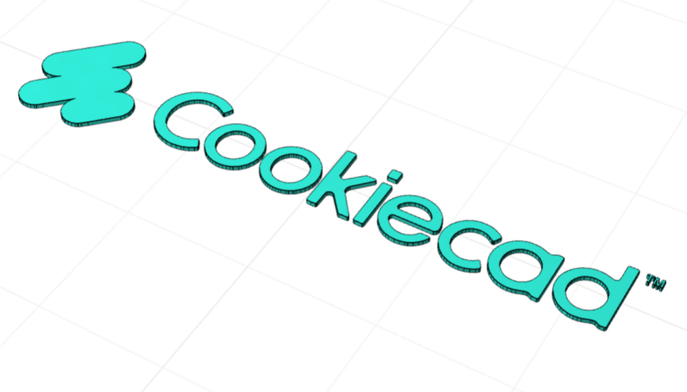

# @cadit-app/image-extrude

Extrude 3D shapes from SVG or bitmap images. Supports both tracing (for raster images) and sampling (for SVGs).



## Features

- **Trace mode**: Convert any bitmap image (PNG, JPG) to 3D by tracing edges (browser only)
- **Sample mode**: High-fidelity conversion of SVG files to 3D
- **Configurable size**: Set maximum width to control output dimensions
- **Despeckle**: Remove small artifacts during tracing
- **CLI support**: Generate GLB and 3MF files from command line (SVG sample mode)

> **Note:** Trace mode for bitmap images currently only works in the browser (CADit). 
> The CLI only supports SVG files with sample mode.

## Installation

```bash
npm install @cadit-app/image-extrude
```

## Usage

### As a CADit Script

Import this script in [CADit](https://cadit.app) by adding the GitHub repository URL.

### CLI Usage

```bash
# Generate GLB from default star shape
npx tsx cli.ts output.glb

# Generate from a specific image
npx tsx cli.ts output.glb --image=logo.svg --height=2 --maxWidth=50

# Generate 3MF
npx tsx cli.ts output.3mf --image=photo.png --mode=trace
```

### CLI Options

| Option | Description | Default |
|--------|-------------|---------|
| `--image=<path>` | Path to image file (SVG, PNG, JPG) | Built-in star |
| `--height=<mm>` | Extrusion height in mm | 1 |
| `--maxWidth=<mm>` | Maximum width in mm | 50 |
| `--mode=<trace\|sample>` | Processing mode | trace |
| `--despeckle=<size>` | Despeckle size for tracing | 2 |

### Programmatic Usage

```typescript
import imageExtrude from '@cadit-app/image-extrude';

// Use the defineParams API
const result = await imageExtrude.main({
  mode: 'trace',
  imageFile: {
    dataUrl: 'data:image/png;base64,...',
    fileType: 'image/png',
    fileName: 'logo.png'
  },
  height: 2,
  maxWidth: 50,
  despeckleSize: 2
});
```

### Creating CrossSections for Embedding

```typescript
import { makeCrossSection } from '@cadit-app/image-extrude';

const crossSection = await makeCrossSection({
  imageFile: { dataUrl: '...', fileType: 'image/svg+xml' },
  mode: 'sample',
  maxWidth: 30
});

// Use in your own maker
const manifold = crossSection.extrude(5);
```

## Parameters

| Parameter | Type | Description |
|-----------|------|-------------|
| `mode` | `'trace' \| 'sample'` | Trace for bitmaps, Sample for SVGs |
| `imageFile` | `object` | Image data with dataUrl, fileType, fileName |
| `height` | `number` | Extrusion height in mm |
| `maxWidth` | `number` | Maximum width in mm |
| `despeckleSize` | `number` | Remove spots smaller than this (trace only) |

## Build & Bundle

This package ships as a **pre-bundled** ES module for browser use.

### Why we bundle

CADit's script runtime uses esbuild to bundle external scripts at runtime, fetching dependencies from CDN (esm.sh). Some dependencies like `potrace` (which uses `jimp` for image processing) don't work correctly when fetched from CDN due to complex browser shims.

By pre-bundling at publish time, we ensure:
- All dependencies are resolved correctly at build time
- The bundle works reliably in CADit's browser environment
- No CDN resolution issues at runtime

### Exports

- **Default** (`@cadit-app/image-extrude`): Pre-bundled version for CADit/browser use
- **Unbundled** (`@cadit-app/image-extrude/unbundled`): TypeScript-compiled modules for Node.js/CLI use

## License

MIT
